文档编号：   MT-JS-003-1                   		 	

项目名称

美俊外卖系统
Meijun Takeout

界面包CSCI详细设计说明书

美俊外卖小组

2025年6月

 
修改记录
版本	变更原因	变更内容简述	编制/修订者	批准者	发布日期
V1.0	完成初稿	无	孙浩翔		2025.06.10

					
 
界面包CSCI详细设计说明书	1
2025年6月	1
1 范围	8
1.1 标识	8
【系统背景】
系统标识符：Meijun Takeout
系统名称  ：美俊外卖系统（MT）
【适用的CSCI】
标识符：CSCI-2
名称  ：界面UI包

1.2 CSCI 概述	8
【系统功能概述】
"Meijun Takeout"应用是一个可以让用户在线浏览餐厅菜品、下单、支付的外卖系统。在这个应用中，用户可以浏览不同分类的菜品，将其加入购物车，管理收货地址，并完成订单支付。除了基本的点餐功能外，系统还支持用户查看历史订单、评价菜品以及个人信息管理。

总的来说，本系统旨在完成并且很好的实现以下的功能：
用户注册
用户登录
修改个人信息
浏览菜品分类
查看菜品详情
添加菜品到购物车
管理购物车
管理收货地址
提交订单
订单支付
查看历史订单
评价订单
用户反馈
商家信息查看

【CSCI层次】
用包图表示本CSCI在系统中的位置（顶层系统包图）。
 
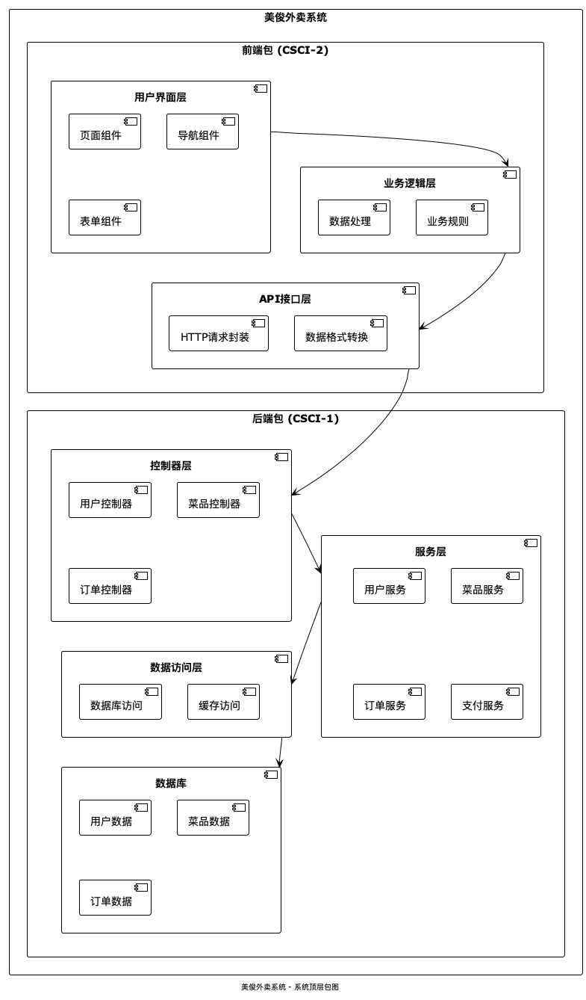

1.3 文档概述	9
【用途】
本CSCI详细说明书用于描述美俊外卖系统的CSCI-界面UI包的详细设计方案，本说明书以《系统需求规格说明书》和《概要设计说明书》作为依据，本说明书是代码实现的依据，也作为单元测试的重要依据。本概要设计说明书的阅读对象为：开发工程师，测试工程师，CM工程师，QA工程师，MA工程师。
【内容】
本文档的主题内容如下：
描述CSCI-2的功能和作用；
描述CSCI-2的内部结构；
描述CSCI-2的各个类的设计；
提供CSCI-2的接口设计；

2 引用的文档	10
按下列格式列出本文档引用到的所有文档。（《系统需求规格说明书》和《系统设计说明书》）
【序号】 【文档编号】 【文档名称】
  01	   MT-JS-001  《美俊外卖系统需求规格说明书》
  02      MT-JS-002  《美俊外卖系统概要设计说明书》

3 前端包详细设计	10
3.1 结构	10
3.1.1 详细结构	10
3.1.1.1 类结构
本系统使用基于组件的设计模式，主要包含以下几个模块：
1. 用户认证模块 - 负责用户的登录、注册和身份验证
2. 首页模块 - 展示餐厅信息和菜品分类
3. 菜品模块 - 展示菜品列表和详情
4. 购物车模块 - 管理用户选择的菜品
5. 订单模块 - 创建和管理订单
6. 用户模块 - 管理用户个人信息和设置
7. 地址模块 - 管理用户收货地址
8. 支付模块 - 处理订单支付

各模块之间的关系如下类图所示：
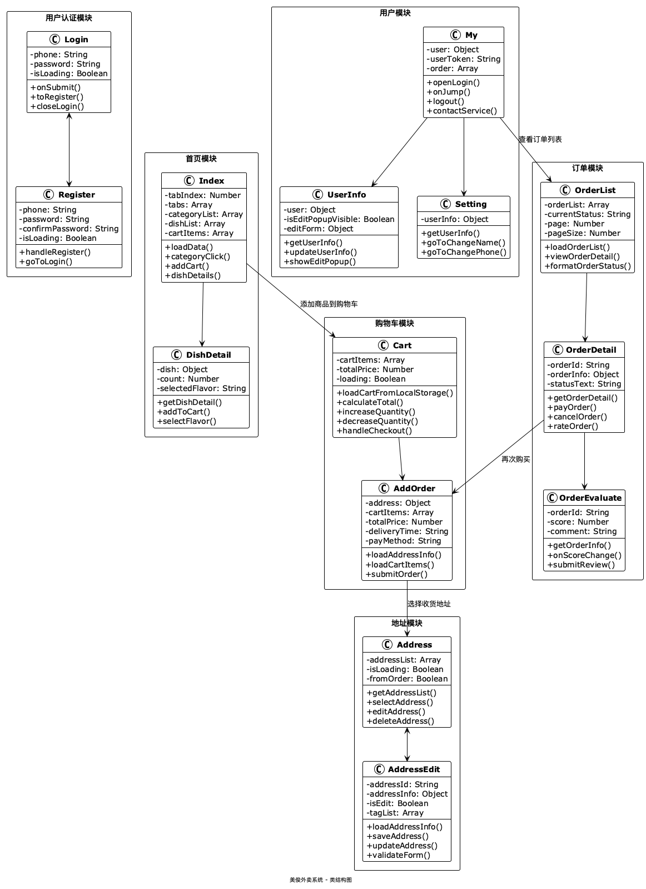

3.1.2 接口关系	11
前端UI包主要通过API调用与后端服务进行交互，关键接口如下：

1. 用户认证接口
   - 登录 (loginApi)
   - 注册 (registerApi)
   - 登出 (logoutApi)
   - 获取用户信息 (getUserInfoApi)

2. 菜品接口
   - 获取分类列表 (categoryListApi)
   - 获取菜品列表 (dishListApi)
   - 获取套餐列表 (setmealListApi)
   - 获取推荐菜品 (recommendationsApi)

3. 购物车接口
   - 获取购物车列表 (cartListApi)
   - 添加到购物车 (addCartApi)
   - 更新购物车 (updateCartApi)
   - 清空购物车 (clearCartApi)

4. 订单接口
   - 提交订单 (submitOrderApi)
   - 获取订单列表 (getOrdersApi)
   - 获取订单详情 (getOrderDetailApi)
   - 订单评价 (submitOrderCommentApi)

5. 地址接口
   - 获取地址列表 (addressListApi)
   - 添加地址 (addAddressApi)
   - 更新地址 (updateAddressApi)
   - 删除地址 (deleteAddressApi)

各接口的交互关系如下图所示：

3.2 运行组织	12
系统运行时的主要流程如下：
1. 用户进入应用后，首先检查登录状态
2. 未登录用户将被导向登录/注册页面
3. 已登录用户将进入主页，可以浏览菜品分类和菜品列表
4. 用户可以将菜品添加到购物车，然后进入购物车页面
5. 在购物车页面，用户可以管理已选择的菜品，并进入结算流程
6. 结算时，用户选择收货地址，确认订单信息后提交订单
7. 订单提交后，进入支付页面完成支付
8. 支付完成后，用户可以在订单列表中查看订单状态和历史订单

系统主要的活动流程如下图所示：

3.3 性能要求	12
UI包在运行时应满足以下性能要求：
1. 页面加载时间：主要页面应在3秒内完成首屏渲染
2. 响应时间：用户交互响应时间应小于300毫秒
3. 内存占用：不应超过系统分配的内存限制
4. 数据缓存：合理使用本地存储，减少不必要的网络请求
5. 错误处理：提供友好的错误提示，确保用户体验
6. 兼容性：支持主流微信版本和设备

3.4 设计限制和约束	13
【限制条件】
硬件条件：
[设备]	支持微信小程序的移动设备	 
[内存]	至少2GB	
[网络]	稳定的网络连接	

软件条件：
[系统]	iOS 10.0以上或Android 5.0以上
[浏览器] 微信内置浏览器
[框架] uni-app

【编程语言】
Vue.js + JavaScript + SCSS

【编译/开发环境】
编译器：HBuilderX
编译环境：uni-app
运行库：微信小程序运行环境

【运行平台】
硬件平台：移动设备（智能手机、平板）
软件平台：微信小程序

4 前端包类详细设计	14
4.1 注册登录页面	14
4.1.1 登录Login类
4.1.1.1 界面预览
登录页面包含手机号输入框、密码输入框、登录按钮和跳转到注册页面的链接。界面简洁清晰，使用黄色主题配色，符合美食外卖系统的整体设计风格。

4.1.1.2 数据成员
- phone - 手机号输入字段
- password - 密码输入字段
- isLoading - 登录状态标识
- loginPopupShow - 登录弹窗显示状态
- isPhoneLogin - 手机号登录方式标识
- PrimaryColor - 主题色

4.1.1.3 主要函数
函数名	功能	URL	请求方式	参数
onSubmit	登录	/api/v1/auth/login	POST	username、password、identity
toRegister	跳转注册页		GET	
closeLogin	关闭登录弹窗			
login	微信登录	/api/v1/auth/wx/login	POST	code、encryptedData、iv

4.1.1.4 接口关系
Login类与以下组件有交互关系：
- Register类：用户可通过登录页面跳转至注册页面
- Index类：登录成功后跳转至首页
- 后端认证服务：进行用户验证

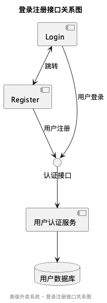

4.1.2 注册Register类
4.1.2.1 界面预览
注册页面包含手机号输入框、密码输入框、确认密码输入框和注册按钮。页面顶部显示注册标题，底部提供返回登录页面的链接。整体风格与登录页面保持一致。

4.1.2.2 数据成员
- phone - 手机号输入字段
- password - 密码输入字段
- confirmPassword - 确认密码输入字段
- isLoading - 注册状态标识

4.1.2.3 主要函数
函数名	功能	URL	请求方式	参数
handleRegister	注册	/api/v1/auth/register	POST	username、password、identity、openid
goToLogin	返回登录页		GET	

4.1.2.4 接口关系
Register类与以下组件有交互关系：
- Login类：用户可通过注册页面返回登录页面
- 后端认证服务：处理用户注册请求

4.2 首页页面
4.2.1 首页Index类
4.2.1.1 界面预览
首页是用户进入应用的主要入口，分为顶部店铺信息区域、菜品分类导航区域和主体内容区域。主体内容区域包含三个标签页：点餐、评价和商家，默认显示点餐标签页。点餐页面左侧为分类列表，右侧为对应分类的菜品列表。页面底部有购物车信息和结算按钮。

4.2.1.2 数据成员
- tabIndex - 当前标签页索引
- tabs - 标签页列表(点餐、评价、商家)
- activeType - 当前选中的分类索引
- categoryList - 分类列表数据
- dishList - 菜品列表数据
- totalPrice - 购物车总价
- cartCount - 购物车商品数量
- cartItems - 购物车数据
- allDishes - 所有菜品数据
- scrollIntoViewId - 滚动定位ID
- commentList - 评价列表

4.2.1.3 主要函数
函数名	功能	URL	请求方式	参数
loadData	加载首页数据			
categoryClick	分类点击处理			分类ID
addCart	添加到购物车	/api/v1/cart/add	POST	itemId、quantity
subtractCart	从购物车减少	/api/v1/cart/sub	POST	itemId、quantity
dishDetails	查看菜品详情			dishId
submitOrder	提交订单			
goToCart	跳转购物车			
formatDate	格式化日期			date

4.2.1.4 接口关系
Index类与以下组件有交互关系：
- Cart类：点击购物车图标跳转至购物车页面
- DishDetail类：点击菜品项跳转至菜品详情页
- 后端服务：获取分类和菜品数据

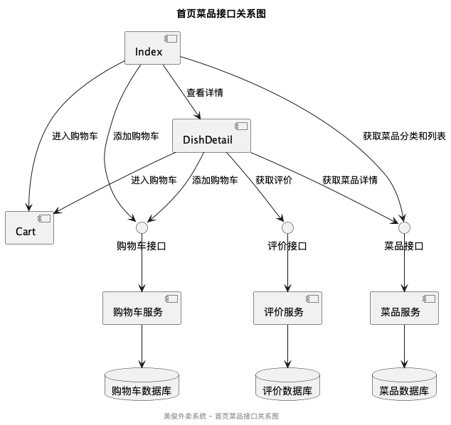

4.2.2 菜品详情DishDetail类
4.2.2.1 界面预览
菜品详情页面展示单个菜品的完整信息，包括菜品图片、名称、价格、描述和评价。页面底部有添加到购物车的按钮。如果菜品有规格选项，会提供规格选择功能。

4.2.2.2 数据成员
- dish - 菜品详细信息
- count - 添加数量
- selectedFlavor - 选中的规格
- cartCount - 购物车数量
- comments - 评价数据

4.2.2.3 主要函数
函数名	功能	URL	请求方式	参数
getDishDetail	获取菜品详情	/api/v1/dish/{id}	GET	id
addToCart	添加到购物车	/api/v1/cart/add	POST	itemId、quantity、flavor
decreaseCount	减少数量			
increaseCount	增加数量			
selectFlavor	选择规格			flavorId
getComments	获取评价	/api/v1/comment/dish/{id}	GET	id

4.2.2.4 接口关系
DishDetail类与以下组件有交互关系：
- Index类：返回首页
- Cart类：添加菜品到购物车后可跳转至购物车
- 后端服务：获取菜品详情和评价数据

4.3 个人中心页面
4.3.1 个人中心My类
4.3.1.1 界面预览
个人中心页面顶部显示用户头像、昵称和手机号等基本信息，中间部分提供全部订单、联系客服等快捷入口，底部有退出登录按钮。如果用户未登录，则显示登录/注册入口。

4.3.1.2 数据成员
- user - 用户信息对象
- userToken - 用户令牌
- order - 最新订单信息
- flag - 是否有订单标识
- loginPopupShow - 登录弹窗显示状态
- isPhoneLogin - 手机号登录方式标识
- showWxLogin - 微信授权登录显示状态
- avatarUrl - 用户头像URL
- nickName - 用户昵称
- phoneUserName - 用户手机号
- logoutshow - 退出确认框显示状态
- showServicePopup - 客服信息弹窗显示状态
- showComplaintPopup - 投诉表单弹窗显示状态

4.3.1.3 主要函数
函数名	功能	URL	请求方式	参数
openLogin	打开登录弹窗			
onJump	跳转到用户信息页			
allOrder	查看全部订单			
logout	退出登录	/api/v1/auth/logout	POST	token
onSubmit	登录提交	/api/v1/auth/login	POST	username、password、identity
toRegister	跳转到注册页			
contactService	联系客服			
showComplaintForm	显示投诉表单			
submitComplaint	提交投诉	/api/v1/feedback	POST	content

4.3.1.4 接口关系
My类与以下组件有交互关系：
- UserInfo类：点击个人信息区域跳转至用户信息页
- OrderList类：点击全部订单跳转至订单列表页
- Login类：未登录状态点击登录/注册按钮
- 后端服务：获取用户信息和订单数据

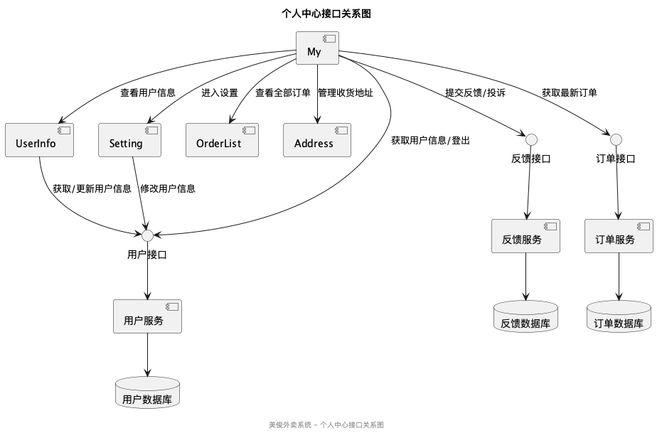

4.3.2 用户信息UserInfo类
4.3.2.1 界面预览
用户信息页面展示用户ID、姓名、用户名、身份、手机号、性别和地址等详细信息。页面底部提供修改信息的按钮，点击后弹出编辑弹窗。

4.3.2.2 数据成员
- user - 用户详细信息
- isEditPopupVisible - 编辑弹窗显示状态
- editForm - 编辑表单数据(name, gender, address)

4.3.2.3 主要函数
函数名	功能	URL	请求方式	参数
getUserInfo	获取用户信息	/api/v1/user	GET	token
autoLogin	自动登录测试账号	/api/v1/auth/login	POST	username、password、identity
showEditPopup	显示编辑弹窗			
hideEditPopup	隐藏编辑弹窗			
onGenderChange	性别选择变更			
updateUserInfo	更新用户信息	/api/v1/user	PUT	name、gender、address
formatPhoneNum	格式化手机号			
getIdentityText	获取身份文本			

4.3.2.4 接口关系
UserInfo类与以下组件有交互关系：
- My类：返回个人中心页面
- 后端服务：获取和更新用户信息

4.3.3 设置页面Setting类
4.3.3.1 界面预览
设置页面提供修改昵称、修改手机号、修改真实姓名、修改身份证号等功能入口。页面采用列表形式展示各设置项，点击后跳转到对应的修改页面。

4.3.3.2 数据成员
- userInfo - 用户信息

4.3.3.3 主要函数
函数名	功能	URL	请求方式	参数
getUserInfo	获取用户信息	/api/v1/user	GET	token
goToChangeName	跳转修改姓名页			
goToChangePhone	跳转修改手机号页			
goToSetNickName	跳转设置昵称页			
goToChangeIdNumber	跳转修改身份证号页			

4.3.3.4 接口关系
Setting类与以下组件有交互关系：
- My类：返回个人中心页面
- ChangeName类：跳转到修改姓名页面
- ChangePhone类：跳转到修改手机号页面
- SetNickName类：跳转到设置昵称页面
- ChangeIdNumber类：跳转到修改身份证号页面

4.4 购物车功能页面
4.4.1 购物车Cart类
4.4.1.1 界面预览
购物车页面顶部显示标题和清空按钮，中间部分展示已选择的菜品列表，包括商品图片、名称、价格和数量控制。如果购物车为空，显示空购物车提示和去购物按钮。底部为结算栏，显示总价和结算按钮。

4.4.1.2 数据成员
- cartItems - 购物车商品列表
- totalPrice - 购物车总价
- loading - 加载状态标识

4.4.1.3 主要函数
函数名	功能	URL	请求方式	参数
loadCartFromLocalStorage	加载购物车数据			
calculateTotal	计算总价			
increaseQuantity	增加商品数量	/api/v1/cart/add	POST	itemId、quantity
decreaseQuantity	减少商品数量	/api/v1/cart/sub	POST	itemId、quantity
removeCartItem	移除购物车商品	/api/v1/cart/remove	DELETE	itemId
handleClearCart	清空购物车	/api/v1/cart/delete	DELETE	
goShopping	前往购物			
handleCheckout	前往结算			
saveToLocalStorage	保存到本地存储			

4.4.1.4 接口关系
Cart类与以下组件有交互关系：
- Index类：返回首页继续购物
- AddOrder类：点击结算按钮跳转到订单确认页面
- 后端服务：管理购物车数据

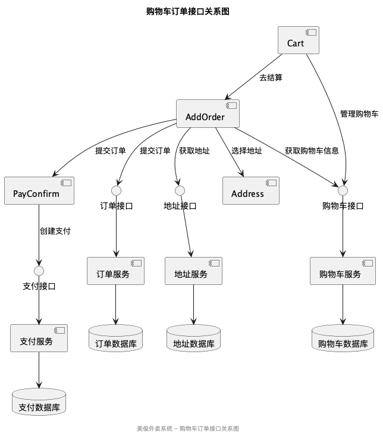

4.4.2 订单确认AddOrder类
4.4.2.1 界面预览
订单确认页面顶部显示收货地址信息，中间部分展示订单商品列表和配送时间选择，底部为支付方式选择和提交订单按钮。用户可以在此页面修改收货地址、选择配送时间和支付方式。

4.4.2.2 数据成员
- address - 收货地址信息
- cartItems - 购物车商品列表
- totalPrice - 商品总价
- deliveryFee - 配送费
- packingFee - 包装费
- actualPrice - 实际支付金额
- remark - 订单备注
- deliveryTime - 配送时间
- payMethod - 支付方式

4.4.2.3 主要函数
函数名	功能	URL	请求方式	参数
loadAddressInfo	加载地址信息	/api/v1/address/default	GET	
loadCartItems	加载购物车商品			
calculateTotal	计算总价			
selectAddress	选择收货地址			
selectDeliveryTime	选择配送时间			
selectPayMethod	选择支付方式			
submitOrder	提交订单	/api/v1/order/submit	POST	addressId、remark、cartItems、deliveryTime、payMethod

4.4.2.4 接口关系
AddOrder类与以下组件有交互关系：
- Cart类：返回购物车页面
- Address类：选择地址跳转到地址列表页面
- PayConfirm类：提交订单后跳转到支付确认页面
- 后端服务：提交订单数据

4.5 订单管理页面
4.5.1 订单列表OrderList类
4.5.1.1 界面预览
订单列表页面展示用户的所有历史订单，按时间倒序排列。每个订单项包含订单号、下单时间、订单状态、商品概览和订单金额。点击订单项可查看订单详情。页面提供不同状态的订单筛选功能。

4.5.1.2 数据成员
- orderList - 订单列表数据
- currentStatus - 当前选中的订单状态
- isLoading - 加载状态标识
- refreshTrigger - 下拉刷新触发器
- page - 分页页码
- pageSize - 每页数量
- noMore - 是否还有更多数据

4.5.1.3 主要函数
函数名	功能	URL	请求方式	参数
loadOrderList	加载订单列表	/api/v1/order/list	GET	status、page、pageSize
onPullDownRefresh	下拉刷新处理			
onReachBottom	上拉加载更多			
selectTab	选择订单状态标签			status
viewOrderDetail	查看订单详情			orderId
formatOrderStatus	格式化订单状态			status
formatDate	格式化日期			date

4.5.1.4 接口关系
OrderList类与以下组件有交互关系：
- My类：返回个人中心页面
- OrderDetail类：点击订单项跳转到订单详情页面
- 后端服务：获取订单列表数据

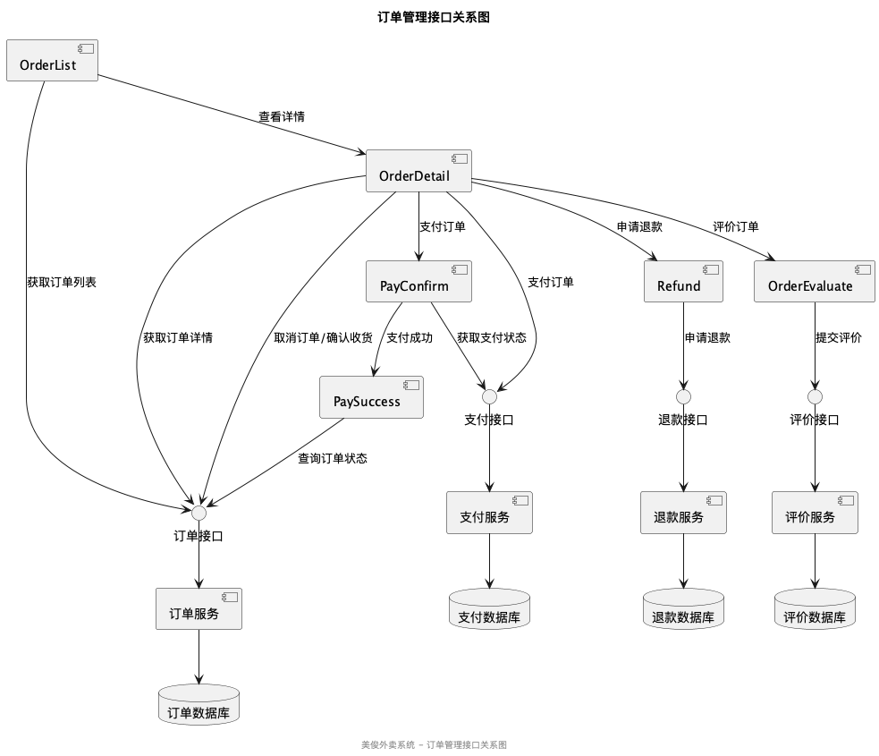

4.5.2 订单详情OrderDetail类
4.5.2.1 界面预览
订单详情页面展示单个订单的完整信息，包括订单状态、商品列表、收货地址、下单时间、订单金额明细等。根据订单状态不同，页面底部提供相应的操作按钮，如支付、取消订单、申请退款、确认收货、评价等。

4.5.2.2 数据成员
- orderId - 订单ID
- orderInfo - 订单详细信息
- isLoading - 加载状态标识
- statusText - 订单状态文本
- showCancelDialog - 取消订单对话框显示状态
- cancelReason - 取消订单原因

4.5.2.3 主要函数
函数名	功能	URL	请求方式	参数
getOrderDetail	获取订单详情	/api/v1/order/detail	GET	orderId
payOrder	支付订单	/api/v1/payment/pay	POST	orderId
cancelOrder	取消订单	/api/v1/order/cancel	POST	orderId、reason
applyRefund	申请退款	/api/v1/order/refund	POST	orderId
confirmReceive	确认收货	/api/v1/order/confirm	POST	orderId
rateOrder	评价订单			orderId
copyOrderNumber	复制订单号			
formatStatus	格式化订单状态			status
formatDate	格式化日期			date
formatAddress	格式化地址信息			address

4.5.2.4 接口关系
OrderDetail类与以下组件有交互关系：
- OrderList类：返回订单列表页面
- RefundPage类：申请退款跳转到退款申请页面
- PayConfirm类：支付订单跳转到支付确认页面
- 后端服务：获取和更新订单数据

4.5.3 订单评价类
4.5.3.1 界面预览
订单评价页面允许用户对已完成的订单进行评分和评价。页面包含商品信息预览、星级评分控件、评价内容输入框和提交按钮。用户可以选择是否匿名评价。

4.5.3.2 数据成员
- orderId - 订单ID
- orderInfo - 订单信息
- score - 评分(1-5星)
- comment - 评价内容
- isAnonymous - 是否匿名评价
- isSubmitting - 提交状态标识

4.5.3.3 主要函数
函数名	功能	URL	请求方式	参数
getOrderInfo	获取订单信息	/api/v1/order/detail	GET	orderId
onScoreChange	评分变更处理			score
submitReview	提交评价	/api/v1/comment/submit	POST	orderId、score、content、anonymous

4.5.3.4 接口关系
OrderEvaluate类与以下组件有交互关系：
- OrderDetail类：返回订单详情页面
- 后端服务：提交评价数据

4.6 地址管理页面
4.6.1 地址列表Address类
4.6.1.1 界面预览
地址列表页面展示用户所有保存的收货地址，每个地址项包含收货人姓名、电话、详细地址、标签信息和操作按钮。页面底部有添加新地址的按钮。支持设置默认地址功能，默认地址会在列表中特别标识。

4.6.1.2 数据成员
- addressList - 地址列表数据
- isLoading - 加载状态标识
- fromOrder - 是否从订单页面跳转而来的标识
- orderId - 相关订单ID

4.6.1.3 主要函数
函数名	功能	URL	请求方式	参数
getAddressList	获取地址列表	/api/v1/address/list	GET	
selectAddress	选择地址			addressId
editAddress	编辑地址			addressId
deleteAddress	删除地址	/api/v1/address/delete	DELETE	id
setDefaultAddress	设置默认地址	/api/v1/address/default	PUT	id
addNewAddress	添加新地址			

4.6.1.4 接口关系
Address类与以下组件有交互关系：
- AddOrder类：返回订单确认页面并传递选择的地址
- AddressEdit类：点击编辑或添加新地址跳转到地址编辑页面
- 后端服务：获取和管理地址数据

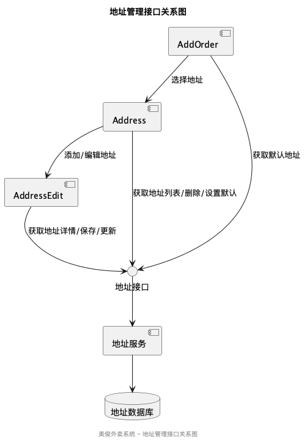

4.6.2 地址编辑AddressEdit类
4.6.2.1 界面预览
地址编辑页面用于添加新地址或编辑现有地址。页面包含收货人姓名、手机号、所在地区选择器、详细地址输入框、标签选择和默认地址设置选项。页面顶部显示标题，底部有保存按钮。

4.6.2.2 数据成员
- addressId - 地址ID（编辑模式）
- addressInfo - 地址信息对象
- isEdit - 是否为编辑模式
- tagList - 标签列表（家、公司、学校等）
- regionVisible - 地区选择器显示状态
- selectedRegion - 已选择的地区信息

4.6.2.3 主要函数
函数名	功能	URL	请求方式	参数
loadAddressInfo	加载地址信息	/api/v1/address/detail	GET	id
onRegionChange	地区选择变更			region
selectTag	选择标签			tag
saveAddress	保存地址	/api/v1/address/save	POST	addressInfo
updateAddress	更新地址	/api/v1/address/update	PUT	addressInfo
validateForm	表单验证			

4.6.2.4 接口关系
AddressEdit类与以下组件有交互关系：
- Address类：保存后返回地址列表页面
- 后端服务：保存和更新地址数据

4.7 优惠券管理页面
4.7.1 优惠券列表Coupon类
4.7.1.1 界面预览
优惠券列表页面展示用户所有可用的优惠券，包括未使用、已使用和已过期三个标签页。每个优惠券项显示优惠金额、使用条件、有效期和使用范围等信息。页面顶部有标题栏，底部提供相关操作按钮。

4.7.1.2 数据成员
- couponList - 优惠券列表数据
- activeTab - 当前选中的标签页索引(未使用/已使用/已过期)
- isLoading - 加载状态标识
- page - 分页页码
- pageSize - 每页数量
- noMore - 是否还有更多数据

4.7.1.3 主要函数
函数名	功能	URL	请求方式	参数
loadCouponList	加载优惠券列表	/api/v1/coupon/list	GET	status、page、pageSize
onTabChange	切换标签页			tabIndex
onPullDownRefresh	下拉刷新处理			
onReachBottom	上拉加载更多			
formatCouponStatus	格式化优惠券状态			status
formatDate	格式化日期			date

4.7.1.4 接口关系
Coupon类与以下组件有交互关系：
- My类：返回个人中心页面
- 后端服务：获取优惠券数据

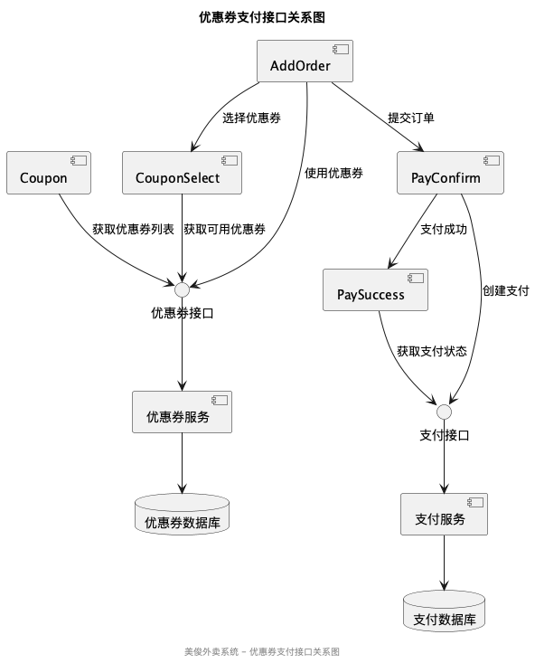

4.7.2 优惠券选择CouponSelect类
4.7.2.1 界面预览
优惠券选择页面展示当前订单可用的优惠券列表。页面顶部显示可用优惠券数量，中间部分为优惠券列表，包括优惠金额、使用条件和有效期等信息。底部有确认使用和不使用优惠券两个按钮。

4.7.2.2 数据成员
- couponList - 可用优惠券列表
- selectedCouponId - 已选择的优惠券ID
- orderAmount - 订单金额
- isLoading - 加载状态标识

4.7.2.3 主要函数
函数名	功能	URL	请求方式	参数
getAvailableCoupons	获取可用优惠券	/api/v1/coupon/available	GET	amount
selectCoupon	选择优惠券			couponId
confirmSelection	确认选择			
cancelSelection	取消选择			
formatDiscount	格式化优惠金额			amount、type

4.7.2.4 接口关系
CouponSelect类与以下组件有交互关系：
- AddOrder类：返回订单确认页面并传递选择的优惠券
- 后端服务：获取可用优惠券数据

4.8 支付相关页面
4.8.1 支付确认PayConfirm类
4.8.1.1 界面预览
支付确认页面显示订单金额和支付方式选择。页面顶部显示订单金额，中间部分提供微信支付、支付宝等支付方式选项，底部有确认支付按钮。页面还显示倒计时，提醒用户在限定时间内完成支付。

4.8.1.2 数据成员
- orderId - 订单ID
- orderInfo - 订单信息
- paymentAmount - 支付金额
- selectedPayMethod - 选中的支付方式
- countdown - 支付倒计时
- isLoading - 加载状态标识

4.8.1.3 主要函数
函数名	功能	URL	请求方式	参数
getOrderInfo	获取订单信息	/api/v1/order/detail	GET	orderId
selectPayMethod	选择支付方式			method
confirmPayment	确认支付	/api/v1/payment/pay	POST	orderId、method
startCountdown	开始倒计时			
formatTime	格式化时间			seconds
cancelPayment	取消支付			

4.8.1.4 接口关系
PayConfirm类与以下组件有交互关系：
- OrderDetail类：返回订单详情页面
- PaySuccess类：支付成功后跳转到支付成功页面
- 后端服务：处理支付请求

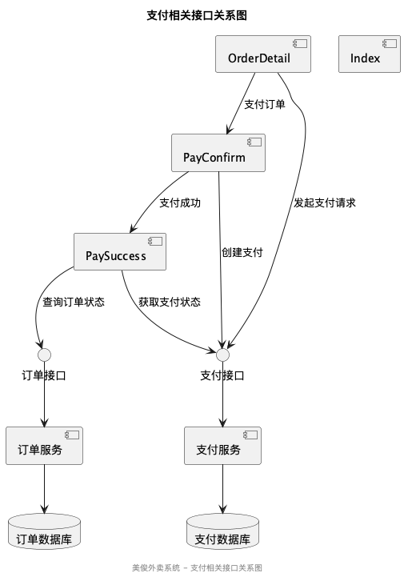

4.8.2 支付成功PaySuccess类
4.8.2.1 界面预览
支付成功页面显示支付结果和相关信息。页面中央有大型成功图标和提示文字，下方显示订单金额和支付方式。底部提供查看订单和返回首页两个按钮。

4.8.2.2 数据成员
- orderId - 订单ID
- paymentAmount - 支付金额
- payMethod - 支付方式
- orderTime - 下单时间

4.8.2.3 主要函数
函数名	功能	URL	请求方式	参数
getPaymentResult	获取支付结果	/api/v1/payment/result	GET	orderId
goToOrderDetail	查看订单详情			
goToIndex	返回首页			
formatDate	格式化日期			date

4.8.2.4 接口关系
PaySuccess类与以下组件有交互关系：
- OrderDetail类：点击查看订单跳转到订单详情页面
- Index类：点击返回首页跳转到首页
- 后端服务：获取支付结果数据

4.9 售后服务页面
4.9.1 退款申请Refund类
4.9.1.1 界面预览
退款申请页面允许用户对已支付的订单申请退款。页面顶部显示订单基本信息，中间部分提供退款原因选择和退款金额输入，底部有提交申请按钮。页面还提供上传凭证功能。

4.9.1.2 数据成员
- orderId - 订单ID
- orderInfo - 订单信息
- refundAmount - 退款金额
- refundReason - 退款原因
- reasonList - 退款原因列表
- imageList - 上传的图片列表
- remark - 退款备注
- isSubmitting - 提交状态标识

4.9.1.3 主要函数
函数名	功能	URL	请求方式	参数
getOrderInfo	获取订单信息	/api/v1/order/detail	GET	orderId
selectReason	选择退款原因			reason
uploadImage	上传图片	/api/v1/common/upload	POST	file
deleteImage	删除图片			index
submitRefund	提交退款申请	/api/v1/order/refund	POST	orderId、amount、reason、images、remark

4.9.1.4 接口关系
Refund类与以下组件有交互关系：
- OrderDetail类：返回订单详情页面
- 后端服务：提交退款申请

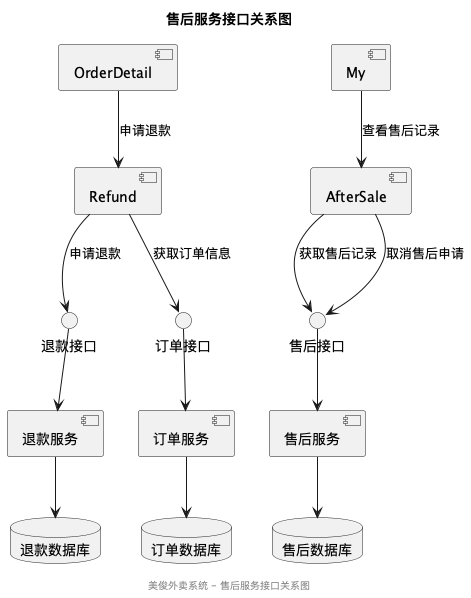

4.9.2 售后服务AfterSale类
4.9.2.1 界面预览
售后服务页面展示用户的售后记录，包括退款、换货、维修等类型。页面顶部有标签栏可切换不同类型的售后记录，每个记录项显示订单信息、申请时间、处理状态和处理结果等。

4.9.2.2 数据成员
- afterSaleList - 售后记录列表
- activeTab - 当前选中的标签索引
- isLoading - 加载状态标识
- page - 分页页码
- pageSize - 每页数量
- noMore - 是否还有更多数据

4.9.2.3 主要函数
函数名	功能	URL	请求方式	参数
loadAfterSaleList	加载售后记录	/api/v1/aftersale/list	GET	type、page、pageSize
onTabChange	切换标签			tabIndex
viewAfterSaleDetail	查看售后详情			id
cancelAfterSale	取消售后申请	/api/v1/aftersale/cancel	POST	id
formatStatus	格式化状态			status
formatDate	格式化日期			date

4.9.2.4 接口关系
AfterSale类与以下组件有交互关系：
- My类：返回个人中心页面
- 后端服务：获取和管理售后记录

4.10 商家相关页面
4.10.1 商家主页MerchantHome类
4.10.1.1 界面预览
商家主页展示商家的基本信息、公告、营业时间和评分等内容。页面顶部有商家封面图和商家名称，下方展示商家介绍、营业时间、配送范围和联系方式等信息。

4.10.1.2 数据成员
- merchantInfo - 商家信息
- noticeVisible - 公告显示状态
- isLoading - 加载状态标识

4.10.1.3 主要函数
函数名	功能	URL	请求方式	参数
getMerchantInfo	获取商家信息	/api/v1/merchant/info	GET	
toggleNotice	切换公告显示状态			
callMerchant	拨打商家电话			
navigateToMerchant	导航到商家			
formatBusinessHours	格式化营业时间			hours

4.10.1.4 接口关系
MerchantHome类与以下组件有交互关系：
- Index类：返回首页
- 后端服务：获取商家信息

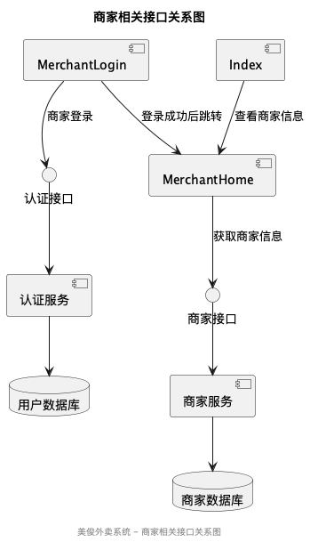

4.10.2 商家登录MerchantLogin类
4.10.2.1 界面预览
商家登录页面供商家用户登录系统。页面包含用户名/手机号输入框、密码输入框和登录按钮。界面简洁清晰，与消费者登录页面风格类似但有所区别。

4.10.2.2 数据成员
- username - 用户名/手机号输入字段
- password - 密码输入字段
- isLoading - 登录状态标识
- rememberPassword - 记住密码标识

4.10.2.3 主要函数
函数名	功能	URL	请求方式	参数
onSubmit	登录	/api/v1/merchant/login	POST	username、password
toggleRememberPassword	切换记住密码			
forgetPassword	忘记密码			
saveLoginInfo	保存登录信息			

4.10.2.4 接口关系
MerchantLogin类与以下组件有交互关系：
- 商家后台主页：登录成功后跳转
- 后端认证服务：验证商家身份

5 数据说明
5.1 内部数据元素
以下是系统内部使用的主要数据元素：

1. 用户数据
   - 用户基本信息：ID、用户名、手机号、昵称、头像等
   - 用户认证信息：Token、登录状态等
   - 用户偏好设置：默认地址、支付方式等

2. 菜品数据
   - 菜品基本信息：ID、名称、价格、图片、描述等
   - 菜品分类信息：分类ID、分类名称等
   - 菜品规格信息：规格选项、价格差异等

3. 购物车数据
   - 商品列表：菜品ID、数量、价格、规格选择等
   - 汇总信息：总价、商品总数等

4. 订单数据
   - 订单基本信息：订单号、下单时间、状态等
   - 订单商品列表：菜品ID、数量、价格等
   - 配送信息：地址ID、配送时间、配送费等
   - 支付信息：支付方式、支付状态等

5. 地址数据
   - 地址基本信息：收货人、电话、详细地址等
   - 地址扩展信息：标签、是否默认等

5.2 外部接口的数据元素
系统与外部接口交互的主要数据元素：

1. 认证接口
   - 请求：用户名、密码、身份类型
   - 响应：Token、用户基本信息

2. 菜品接口
   - 请求：分类ID、页码、每页数量
   - 响应：菜品列表、分类信息

3. 购物车接口
   - 请求：商品ID、数量、规格
   - 响应：购物车详情、操作结果

4. 订单接口
   - 请求：地址ID、商品列表、配送时间、支付方式
   - 响应：订单ID、订单状态

5. 地址接口
   - 请求：地址详情
   - 响应：地址列表、操作结果

6 需求可追踪性
下表展示了系统需求规格与界面包各类之间的映射关系：

表6-1 需求、接口规格映像表
规格标识符	分配的类
用户登录	Login、MerchantLogin
用户注册	Register
浏览首页	Index
查看菜品详情	DishDetail
管理购物车	Cart
提交订单	AddOrder
支付订单	PayConfirm、PaySuccess
查看订单列表	OrderList
查看订单详情	OrderDetail
评价订单	OrderEvaluate
管理地址	Address、AddressEdit
管理优惠券	Coupon、CouponSelect
退款/售后	Refund、AfterSale
个人中心	My
用户信息	UserInfo
系统设置	Setting
商家信息	MerchantHome
